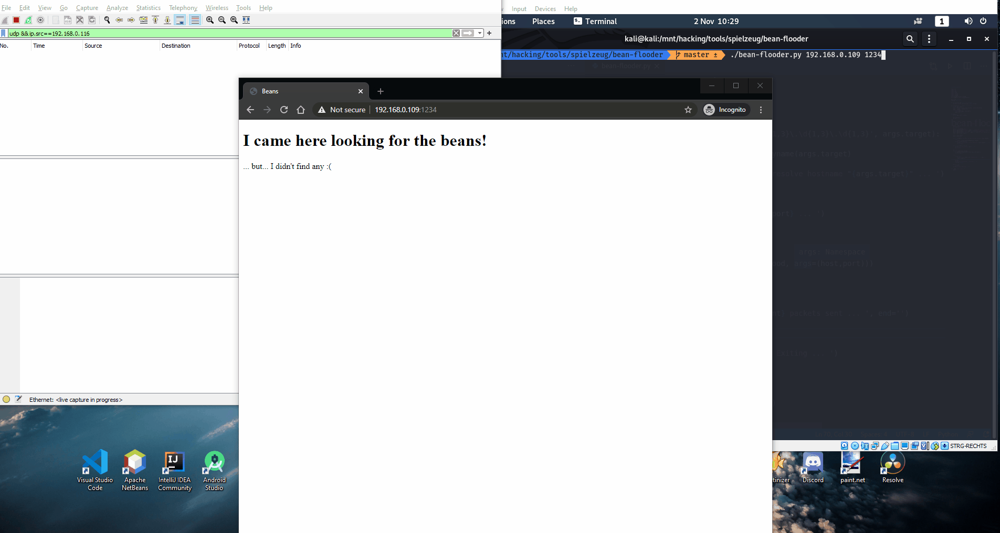

# Bean-Flooder
_Beans - assemble!_

---

## About

Have you ever felt the need to completely pollute your network with garbage data, so much so that you will barely be able to load a simple website - all for the simple purpose to DoS one host on your network?

If you have, and I'm sure you have ;), then this is the tool for you! The **Bean-Flooder** will take down any service running on your network as long as you accept that transmission speeds will be trash for everyone during the attack ... ^^

## Usage

```txt
usage: bean-flooder.py [-h] [--threads THREADS] target port
bean-flooder.py: error: the following arguments are required: target, port
```

... as you can see, besides the absolutely necessary parameters `host` (the target's ip address) and `port` (the port the target service is running on) the **Bean-Flooder** also accepts an argument called `threads`. ... It' not too difficult to guess now that this is in fact a _multi-threaded_ attack (_much w0w, much 1337_) and this parameter will specify how many threads the script should use.

## PoC

... just to show you that this is in fact the real deal... ^^ (I'm kidding of course, please, don't try anything serious with this... it'll probably just pollute your network ... ^^ - but it does work fairly well on a small scale ...)


